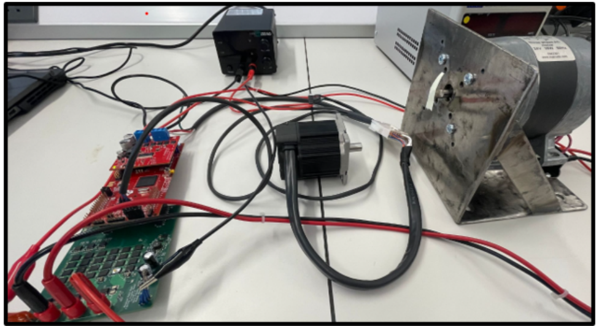
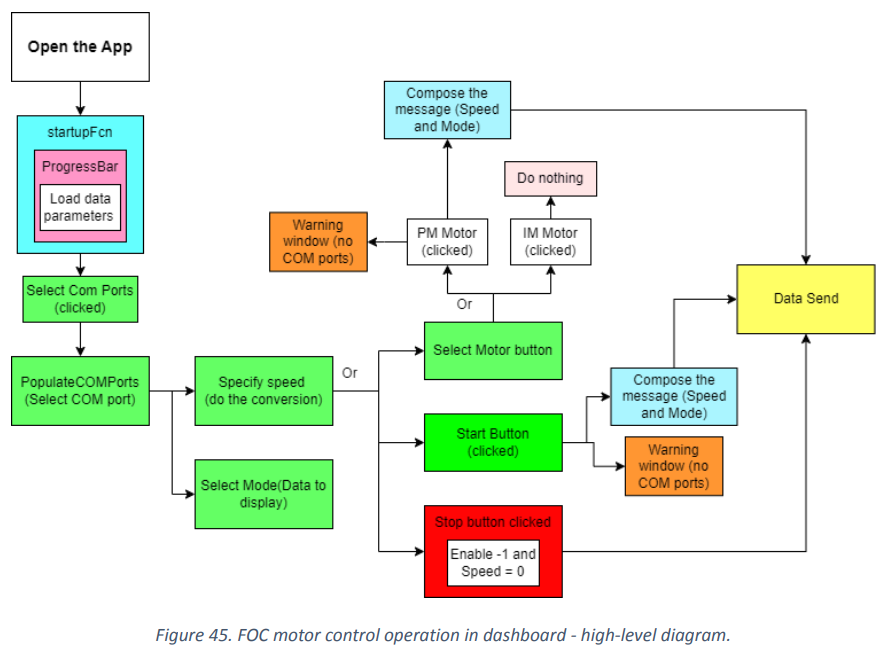
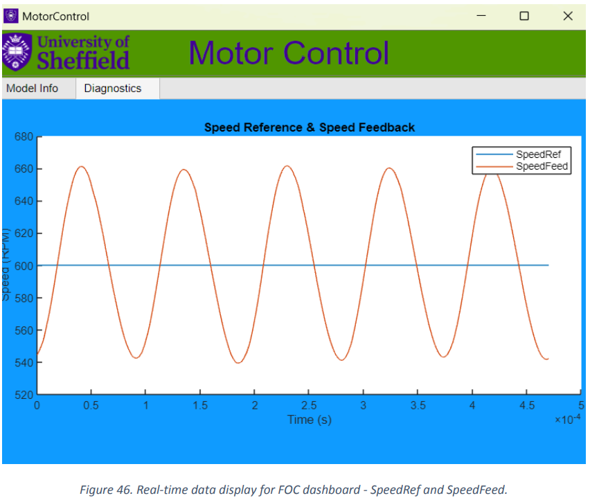

# C2000_Boards — Motor Control + Real-Time Dashboards (MATLAB/Simulink)

This repository contains MATLAB/Simulink projects for **TI C2000** motor-control development (e.g., FOC / open-loop control) and **host-side dashboards** to control the motor and visualise real-time metrics (speed, currents, etc.) over serial.

> ⚠️ **Safety note**: Motor drives can be hazardous. Use proper isolation, current limiting, and follow TI hardware guidelines. Run initial tests at low voltage/current.

## Demo
[Watch the demo video (Google Drive)](https://drive.google.com/file/d/1xDw4fCx2-SH803H9Xw2Jfc1-25vwOXAM/view?usp=sharing)

## Figures / Screenshots

### Hardware test setup
FOC / motor-control development setup using TI C2000 hardware, motor + load/fixture, and host-side serial link.

<p align="center">
  
</p>

### FOC dashboard workflow (high-level)
App flow for selecting COM port, configuring speed/mode, starting/stopping the motor, and streaming telemetry.

<p align="center">
  
</p>

### Real-time telemetry examples (dashboard)
Below are example plots streamed and visualised in the App Designer dashboard.

<p align="center">
  
  
</p>

## What’s inside

### Folder structure
```text
matlab/
  apps/            # App Designer dashboards (.mlapp)
  host/            # PC-side scripts (serial receive, plotting, parameter setup)
  models/          # Simulink models for C2000 projects
    foc/           # Field-Oriented Control related models
    open_loop/     # Open loop / basic control models
    adc_io/        # ADC / IO experiments
    comms_serial/  # Serial communication models/tests
  utils/           # Reusable helpers (filters, FFT, etc.)

Pics/              # Screenshots / figures (may move to docs/ later)
resources/         # Project resources (MATLAB project metadata, etc.)
